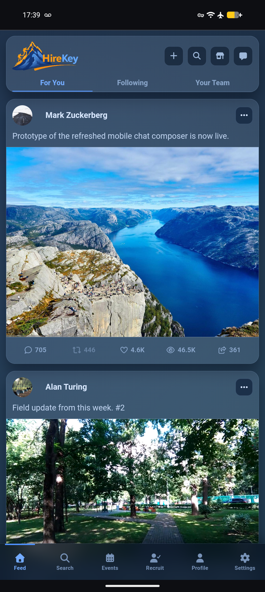
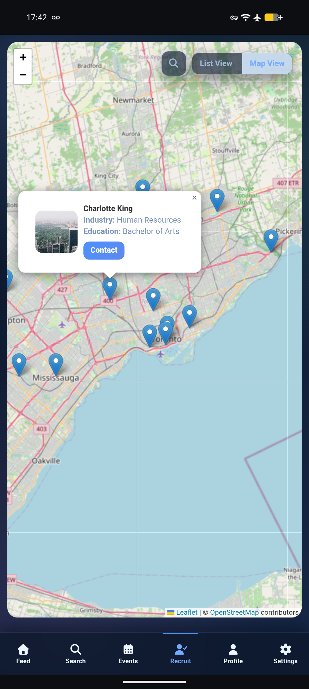
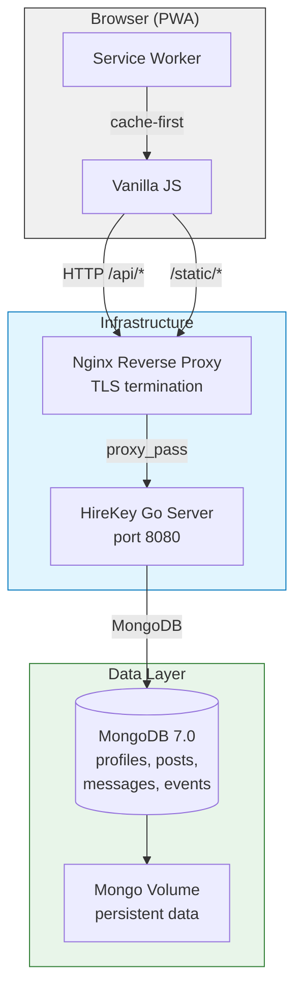

# HireKey

Go backend · MongoDB · Vanilla JS — Social networking and professional recruitment platform with real-time chat, feed, and events.


| Feed View | Profile View | Recruiting View |
|---|---|---|
|  |  |  |
| Feed page with multi-tab layout (For You, Following, Your Team), engagement metrics, media attachments, and pagination via `limit`/`offset`. | Profile page with story viewer, follow/block actions, detail rows, and embedded event cards with RSVP. | Leaflet.js map view of recruitment candidates with geographic markers, industry tags, and list/map toggle. |

---
## Quick Start

**Prerequisites:** Go 1.25+, MongoDB 6.0+, Docker (optional)

```bash
# Clone
git clone https://github.com/alextitosdev/hirekey.git
cd hirekey

# Option A: Run with Docker Compose (recommended)
# Note: Config is baked into src/env.go. Edit before build.
docker compose up -d

# Option B: Run natively
make run
```

**Expected output:**
```
HireKey starting...
Server starting on :8080
```

Access: `http://localhost:8080`

**Stop containers:** `docker compose down`

---

## Tech Stack

| Layer        | Technology                          |
|--------------|-------------------------------------|
| Language     | Go 1.25                             |
| Database     | MongoDB 7.0                         |
| Frontend     | Vanilla JavaScript (ES modules)     |
| Templates    | Go html/template                    |
| Auth         | Cookie-based sessions + 2FA         |
| Map Rendering| Leaflet.js                          |
| Container    | Docker / docker-compose             |
| Reverse Proxy| Nginx (TLS, static serving, proxy)  |
| OS Service   | systemd                             |

---

## Architecture



---

## Reproducibility

### Configuration

All runtime config lives in `src/env.go` as Go variables — no `.env` parsing, you must edit the file directly:

```go
var MongoDBURL string = "mongodb://localhost:27017"
var DBName        string = "hirekey"
var Port          string = "8080"
var EnableLogin   bool = true
// ... mock toggles
```

### Database Initialization

No schema migration required. Collections are created on first insert. For a clean state:

```bash
# Drop database (development)
mongosh --eval "db.getSiblingDB('hirekey').dropDatabase()"

# Or in docker-compose:
docker compose down -v && docker compose up -d
```

### Build Commands

```bash
# Native build (static binary, no CGO)
make build
ls -lh build/hirekey

# Docker build (multi-stage, ~65MB final image)
docker compose build --no-cache
```

**Expected build output:**
```
==> Building hirekey...
==> Build complete: build/hirekey
```

**Static binary verification:**
```bash
ldd build/hirekey
# not a dynamic executable
```

---

## Deployment & Operations

### Docker Compose (Development / Staging)

```yaml
# docker-compose.yml included in repository
# Services: hirekey-app, hirekey-mongo
# Volume: mongo-data (persistent)
# Health check: mongosh ping every 10s
# Logging: json-file driver, 10MB max, 3 files retained
```

### Systemd (Production)

```bash
# Deploy binary
sudo cp build/hirekey /opt/hirekey/
sudo chown hirekey:hirekey /opt/hirekey/hirekey

# Configure environment
sudo cp deploy/env.example /etc/hirekey/env
sudo nano /etc/hirekey/env  # Edit MongoDB URI, etc.

# Enable service
sudo cp deploy/hirekey.service /etc/systemd/system/
sudo systemctl daemon-reload
sudo systemctl enable --now hirekey
sudo systemctl status hirekey
```

**Hardening features in the systemd unit:**
- `NoNewPrivileges=true` — cannot escalate
- `ProtectSystem=strict` — read-only filesystem (except `/opt/hirekey`)
- `PrivateTmp=true` — isolated temp directory
- `ReadWritePaths=/opt/hirekey` — only app dir is writable

### Scaling Considerations

- **Stateless app layer** — multiple `hirekey-app` instances behind a load balancer work identically. Session state lives in MongoDB, not memory.
- **MongoDB** — use a replica set for production. The app uses a single connection URI that supports failover.
- **Connection pooling** — the mongo-driver handles pooling internally. Tune via `MONGO_URI` parameters (`maxPoolSize`, `minPoolSize`) if needed.
- **Story garbage collection** — runs every 5 minutes in a goroutine. For high-traffic, consider moving to a dedicated worker process or MongoDB TTL index.

### Logging & Monitoring

- **Application logs** — written to `stderr`, collected by systemd journal or Docker logging driver.
- **Structured log entries** via `log.Printf` with severity context (errors include the error object).
- **MongoDB slow queries** — monitor with `db.collection.find(...).explain("executionStats")`.
- **Process metrics** — add a `/metrics` endpoint by wiring in `prometheus/client_golang` for Go runtime stats (goroutines, heap, etc.).

---

## Project Structure

```
hirekey/
├── cmd/server/main.go         # Entry point
├── src/
│   ├── api.go                 # API handlers 
│   ├── chat.go                # Chat message endpoints
│   ├── login.go               # Auth middleware, session mgmt
│   ├── web.go                 # HTTP routing, template serving
│   ├── env.go                 # Runtime configuration
│   ├── utils.go               # Input sanitization
│   ├── utils_api.go           # Profile resolution, JSON helpers
│   ├── types_*.go             # Type definitions (22 files)
│   ├── mock_*.go              # Mock data seeding
│   ├── templates/             # HTML templates
│   └── static/                # CSS, JS, images, fonts, PWA
├── deploy/
│   ├── hirekey.service        # Systemd unit
│   └── hirekey-nginx.conf     # Reverse proxy config
├── docker-compose.yml         # Multi-service deployment
├── Dockerfile                 # Multi-stage build
├── Makefile                   # Build/run/deploy commands
├── .gitignore
├── go.mod
├── go.sum
└── README.md
```

---

## License

[CC BY-NC 4.0](LICENSE) — free for personal and educational use. Commercial licensing available on request.

